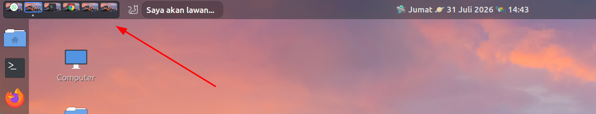
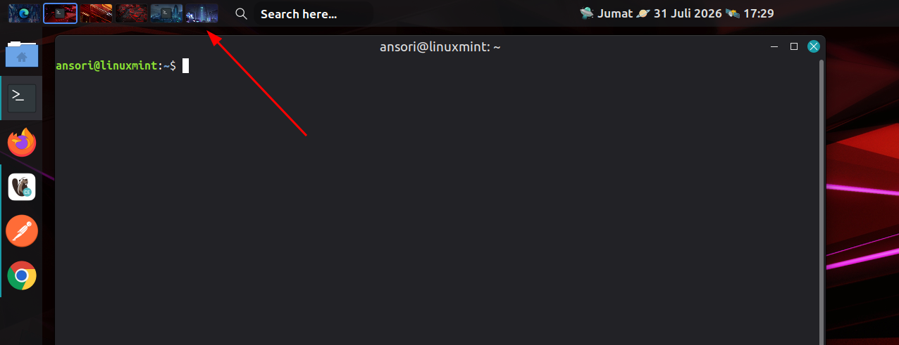

# Overview Workspace Switcher for Cinnamon

A sleek, highly customizable workspace switcher applet for the Cinnamon desktop environment. Instead of simple blocks or numbers, this applet features an **Overview Mode** that displays a miniature version of your desktop wallpaper along with the top-most application icon for each workspace.

## Preview



## ✨ Features

* **🖼️ Overview Mode:** Displays your current desktop wallpaper inside the workspace boxes.
* **📱 App Icons:** Automatically detects and displays the icon of the currently focused/top-most window in each workspace.
* **🎨 Theme Support:** Includes built-in **Dark** and **Light** themes to match your Cinnamon panel style.
* **📍 Active Indicators:** Clearly see which workspace you are on. You can choose to hide the indicator or select from three styles:
  * Triangle (▲)
  * Circle Filled (●)
  * Circle Empty (○)
* **📏 Custom Sizing:** Panel too big or too small? You can easily override the default sizes and set a custom width and height for the workspace boxes directly from the settings.
* 🖼️ Per-Workspace Wallpapers: Set custom background images for each workspace (up to 10 workspaces) that automatically change when you switch workspaces.
* ⚙️ Workspace Management Shortcut: Quick button in settings to open native Linux Mint workspace settings for adding or removing workspaces.
* 🎚️ Custom Transparency: Toggle and adjust the opacity slider for the main applet container to seamlessly blend with your panel.

## 📦 Installation

We provide an installation script to make the process quick and seamless.

1. Clone this repository or download the ZIP file and extract it.
2. Open your terminal and navigate to the downloaded folder.
3. Make the installation script executable (if it isn't already):
   ```bash
   chmod +x install.sh
   ```
4. Run the installation script:
   ```bash
   ./install.sh
   ```
5. Restart Cinnamon to load the new applet:
   * Press `Alt + F2`
   * Type `r` and press `Enter`.
6. Open **System Settings** -> **Applets**.
7. Find **Overview Workspace Switcher** in the list, enable it, and add it to your panel.

## ⚙️ Configuration

Right-click on the applet in your panel and select **Configure...** to access the settings:

* **Theme:** Choose between Dark and Light.
* **Overview Window:** Toggle the wallpaper and app icon preview on or off (if off, it will simply display the workspace number).
* **Show Active Workspace Indicator:** Toggle the bottom indicator on or off.
* **Indicator Shape:** Choose the style of the active workspace indicator.
* **Manual set workspace box size:** Enable this to unlock custom dimensions.
  * **Box Height & Width:** Adjust the sliders to fit your specific panel size.

## 🤝 Contributing

Contributions, issues, and feature requests are welcome! Feel free to check the issues page if you want to contribute.

## 📝 License

This project is open-source and available under the MIT License.

---
*Created for the Cinnamon Desktop Environment.*
